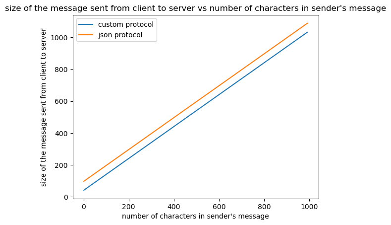

# Communication Protocol

## JSON Implementation

- **Version Check:**
  - Each client sends a fixed-length version string.
  - The server validates the version and sends an error (and closes the connection) if there’s a mismatch.

- **Request/Response Structure:**
  - **Requests:**
    - Include a `"type"` field (e.g. `"register"`, `"login"`, `"send"`).
    - Encoded as a JSON object and sent over the socket.
  - **Responses:**
    - Return at least a `"status"` and a `"message"`.
    - May include extra fields (e.g. message IDs, user list) when necessary.

## Binary Implementation

- Similar to the JSON implementation, but messages are sent and received in binary format instead of JSON. Request types are associated with a particular integer.

---

# User Interface (Tkinter)

## Login and Account Management

- **Login Frame:**
  - Allows users to enter a username (with a dropdown combo that updates immediately with both new and existing usernames).
  - Contains a masked password field.
- **Registration:**
  - Users can register with a unique (non-reusable) username.
  - Passwords are hashed using **SHA-256** before being sent.

## Chat Window and Conversation Management

- After login, the interface displays a list of conversations with unread counts (indicated by a red dot).
- For each conversation:
  - A new chat window opens that contains:
    - An entry field for composing messages and a "Send Message" button.
    - A dropdown to choose the number of messages to read.
    - The ability to delete (unsend) an unread message (via double-click).
- **Draft Messages:**
  - Unsent or drafted messages are tracked so that if a chat window closes, the draft remains—but drafts are cleared after logout.

---

# Threading and Subscription

## Server Side

- A new thread is spawned for each client connection, allowing simultaneous interactions from multiple clients.

## Client Side

- A dedicated subscription thread maintains a persistent connection with the server to receive push messages.
- The subscription thread updates the conversation history and any open chat windows in real time.

---

# Message Handling and Sending

## Sending Messages

- **Unique Message IDs:**
  - Each message is assigned a unique ID (using `uuid4`) and stored on the server.
- **Real-Time Delivery:**
  - If the recipient is online, the server pushes the message immediately via the subscription connection.
- **Sequential Reading:**
  - Every message must be read before sending another message.

## Reading and Marking Messages

- The client loads messages from the server.
- In the chat window, unread messages remain until the user triggers a **"mark_read"** action, which marks a specified number (or all) of unread messages as read.
- The conversation list updates with real-time unread counts.
- Draft messages are tracked as described above.

## Deleting Messages

- Unread messages sent by the user can be unsent or deleted:
  - The user double-clicks an unread message.
  - The UI prompts for deletion.
  - The server marks the message as “deleted” so that it no longer appears in the conversation.

---

# Design Decisions

## Creating an Account

- The client sends a **"register"** request with a username and a **SHA-256 hashed password**.
  - The password is hashed before sending across the network.
- The server checks if the username exists; if not, it adds the user to its JSON store.

## Log in to an Account

- The client sends a **"login"** request with the username and hashed password.
- The server validates credentials and ensures the user is not already logged in.
  - A user cannot log in from multiple applications simultaneously.
- Users can view all existing conversations and the number of unread messages for each conversation.

## List Accounts (or Filter by Wildcard)

- The client dynamically updates the dropdown for both login and new message recipients.
  - As the user types, suggestions are updated.
  - If the input is empty, all usernames are shown.

## Send a Message

- When a user sends a message, the client issues a **"send"** request including:
  - Sender, recipient, and message text.
- The server assigns a unique message ID (using `uuid4`), stores the message under the recipient’s account, and pushes it via the subscription connection if the recipient is online.
- The client requires all unread messages to be read before sending another message.

## Read Messages

- In the chat window, unread messages remain unread until the user triggers a **"mark_read"** request by reading a specified number of messages.
  - This marks a specified number (or all) of unread messages as read.
- The conversation list updates with real-time unread counts.
- Draft messages are preserved if a chat window closes but are cleared upon logout.

## Delete a Message

- If a user double-clicks an unread message they sent (and it hasn’t been read by the recipient):
  - The UI prompts for deletion.
  - The server marks the message as deleted so that it no longer appears in the conversation.

## Delete an Account

- The **"delete_account"** request marks the user as deleted on the server and removes them from active subscribers.
- The UI clears local conversation data and returns the user to the login screen.
- Once deleted, the username becomes unavailable for registration.
- Other users can still view previous chat history but cannot send new messages to the deleted account.

## User Interface

- The UI employs real-time updates through a background subscription thread.
- Multiple conversation windows allow users to handle several chats concurrently.

## Connection

- If `sys.stdin` is connected to a terminal, the user must input the desired host and port.
- Otherwise, default host and port values are used (primarily to avoid user input during tests).

# Comparison Between JSON and Custom Protocol:

In both JSON and custom protocol implementations, each client creates a new thread, which runs in the background, allowing support with many clients at once. Thus in terms of scalability, both programs should theoretically be able to support many clients. 

However, there are significant differences in efficiency between the two implementations. In the JSON implementation, it sends information from the client to the server as a JSON object, and it converts the response from the server to the client into a JSON object. Meanwhile, the custom wire protocol sends and receives information in binary format. Thus, the JSON implementation is less inefficient in terms of time and message size sent back and forth between the client and server due to the overhead of dealing with JSON objects instead of the raw binary formats. We can see this through empirical experiments. 

The figures below show the results of an experiment where we sent messages of $n$ characters 10 times and averaged the results over those 10 trials for each $n$. 
1) We can see in Figure 1 that the size of the message sent from the client to the server is larger for the JSON implementation than the custom implementation because sending a message as a JSON object adds additional space compared to the binary format. We can also see that for both implementations, the message size linearly increases as the character count increases in the message, which is as expected.
2) We can see in Figure 2 that the size of the response sent from the server to the client is larger for the JSON implementation than the custom implementation because for the JSON implementation, the response has to be in a format that can be converted into a JSON object, while that is not necessary for the custom implementation. For both implementations, the response size is static as the character count increases because the response from the server in both implementations is independent of the character count, meaning the server does not send back the original message; thus, the response message size is always the same, independent of the original message size.
3) We can see in Figure 3 that the time taken to send a message is significantly faster with the custom implementation compared to the JSON implementation. While the time taken increases linearly with the character count using the JSON implementation, there is seemingly no increase in time taken in the custom implementation. If we look at Figure 4, which only shows the time taken for the custom implementation, we can see that there are fluctuations and some slight increase in time as the character count increases, but we can clearly see from Figure 3 that the custom implementation is far more efficient than the JSON implementation in terms of time. 

Figure 1:

Figure 2:

Figure 3:

Figure 4:

